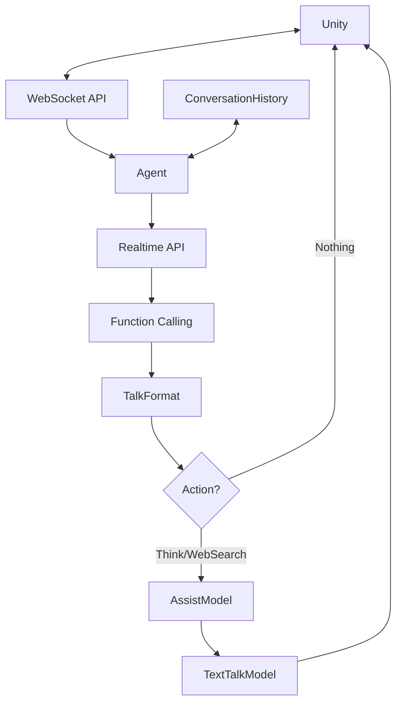

# システム設計パターン（systemPatterns.md）

## アーキテクチャ概要
- FastAPI を用いた WebSocket/REST API サーバ
- エージェント処理は agent.py に集約
- プロンプト設計は prompt.py で管理
- 構造化応答（content, action, emotion など）を標準化
- 会話履歴管理は独立したクラスで実装

## 主な設計方針
- シンプルで拡張しやすい構成
- 旧実装（src/old/）の複雑さを排除
- 全体のフロー管理にはlangchain等の重厚なフレームワークは使用しない
- AssistModelの実装にはLangChainのReAct Agentを部分的に利用
- エラーハンドリングの段階的な強化
- 疎結合なコンポーネント設計

## コンポーネント関係
### 基本フロー
- api.py（APIエンドポイント）⇔ agent.py（エージェント処理）⇔ prompt.py（プロンプト定義）
- すべての応答は WebSocket 経由で Unity へ返却

### データフロー

